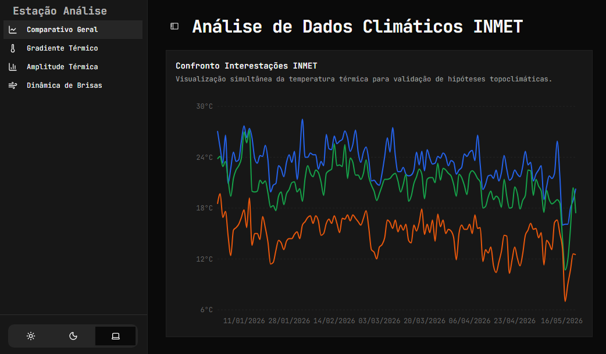

# Análise de Dados Climáticos INMET

<div align="center">



</div>

## Clonando a solução

```bash
git clone git@github.com:jodonijr/estacao-analise.git
```

## Executando

```bash
npm install
npm run dev
```
